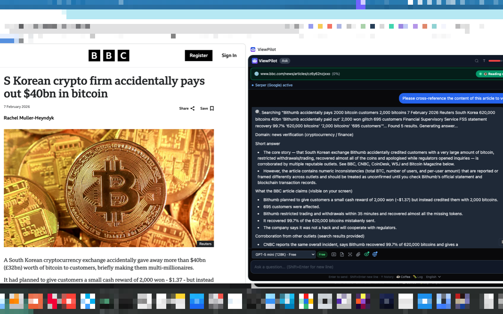
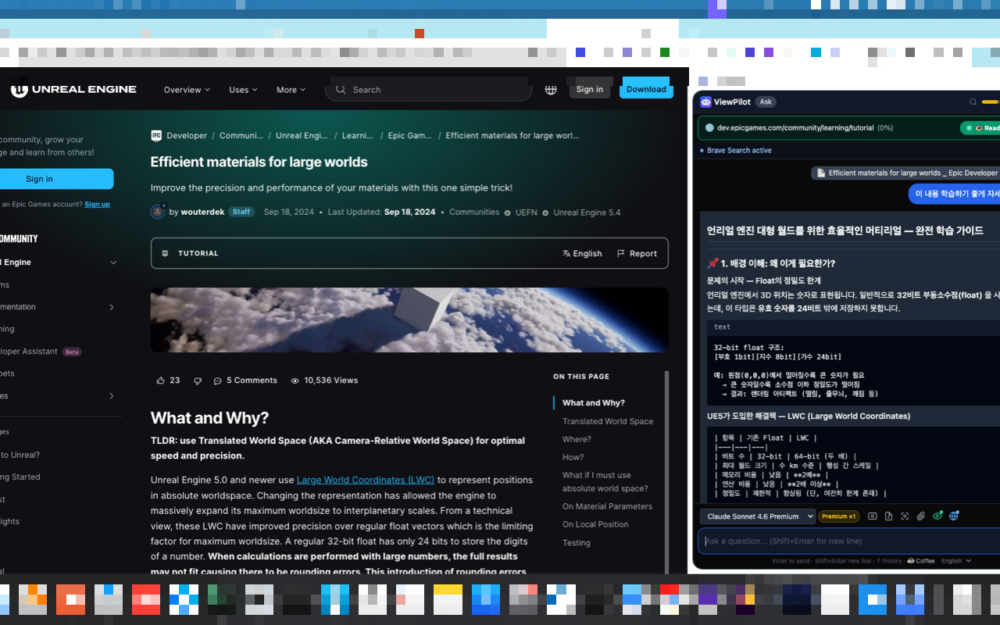
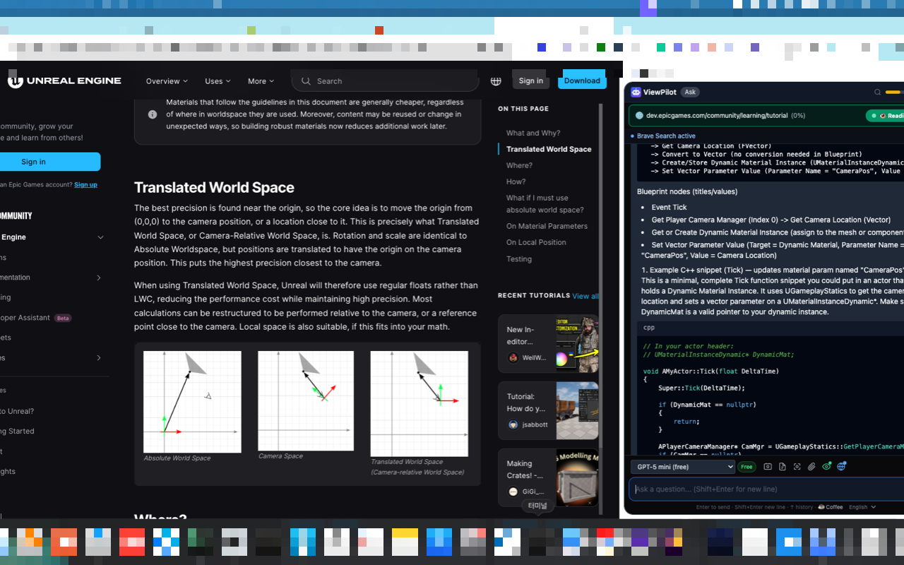

<p align="center">
  
</p>

<h1 align="center">ViewPilot</h1>

<p align="center">
  AI browser sidebar powered by GitHub Copilot
</p>

<p align="center">
  <a href="https://chrome.google.com/webstore"></a>
  <a href="https://addons.mozilla.org/firefox/addon/viewpilot/"></a>
  <a href="https://microsoftedge.microsoft.com/addons/detail/viewpilot/ocnagbhegoacffhejllfedejaclpmoki"></a>
  <a href="https://ko-fi.com/giljun"></a>
  
  
</p>

---

I built ViewPilot because I kept forgetting to use GitHub Copilot. It just wasn't in my flow. So I made a sidebar that's always there — no tab switching, no breaking focus.

Now, whenever I'm studying something or a question pops up, I just ask. It made Copilot actually useful for everyday browsing, not just coding.

## Features

- **AI Chat in Sidebar** — Chat with AI using your current page as context, with automatic viewport content reading
- **20+ AI Models** — GPT-5.4, Claude Opus 4.6, Gemini 3.1 Pro, and more — smart sorted (free first, by context size)
- **Web Search** — DuckDuckGo (free, no API key), Brave, or Google (Serper) integration
- **Page Context** — Extract page text, capture screenshots (single or full-page scroll), attach files
- **Chat History** — Save and manage multiple conversations
- **Quota Tracking** — Monitor your GitHub Copilot premium request usage
- **Math Rendering** — LaTeX / KaTeX support
- **Font Size Control** — 10-level font scaling for accessibility
- **Context Menu** — Right-click selected text to send to ViewPilot
- **Google Docs Support** — Works with Google Docs canvas mode
- **Multi-Language** — English, Korean, Japanese, Chinese, Spanish

## Screenshots

<p align="center">
  
  
  
</p>

## Requirements

- A paid [GitHub Copilot](https://github.com/features/copilot) subscription (Pro, Business, or Enterprise)

## Installation

### From Browser Stores

| Browser | Link |
|---------|------|
| Chrome  | [Chrome Web Store](https://chrome.google.com/webstore) (under review) |
| Firefox | [Firefox Add-ons](https://addons.mozilla.org/firefox/addon/viewpilot/) |
| Edge    | [Edge Add-ons](https://microsoftedge.microsoft.com/addons/detail/ocnagbhegoacffhejllfedejaclpmoki) |

### Build from Source

```bash
git clone https://github.com/bymebyu/ViewPilot.git
cd ViewPilot

pnpm install

# Development
pnpm dev              # Chrome
pnpm dev:firefox      # Firefox

# Production build
pnpm build            # Chrome (default)
pnpm build:all        # Chrome + Edge + Firefox

# Create zip packages
pnpm zip:all
```

## Privacy

ViewPilot does not collect, store, or transmit any personal data. All AI communication goes directly between your browser and the GitHub Copilot API. Web search (when enabled) only sends the search query — no personal data.

Read the full [Privacy Policy](docs/privacy-policy.md).

## Disclaimer

ViewPilot is **NOT** an official GitHub or Microsoft product. It is an independent, community-developed browser extension that utilizes the GitHub Copilot API. GitHub, Copilot, and related trademarks belong to their respective owners.

## Contributing

Contributions are welcome! Please read [CONTRIBUTING.md](CONTRIBUTING.md) for guidelines.

## License

This project is licensed under the GPL-3.0 License — see [LICENSE](LICENSE) for details.

## Support

If you find ViewPilot useful, consider supporting the project:

<a href="https://ko-fi.com/giljun"></a>
